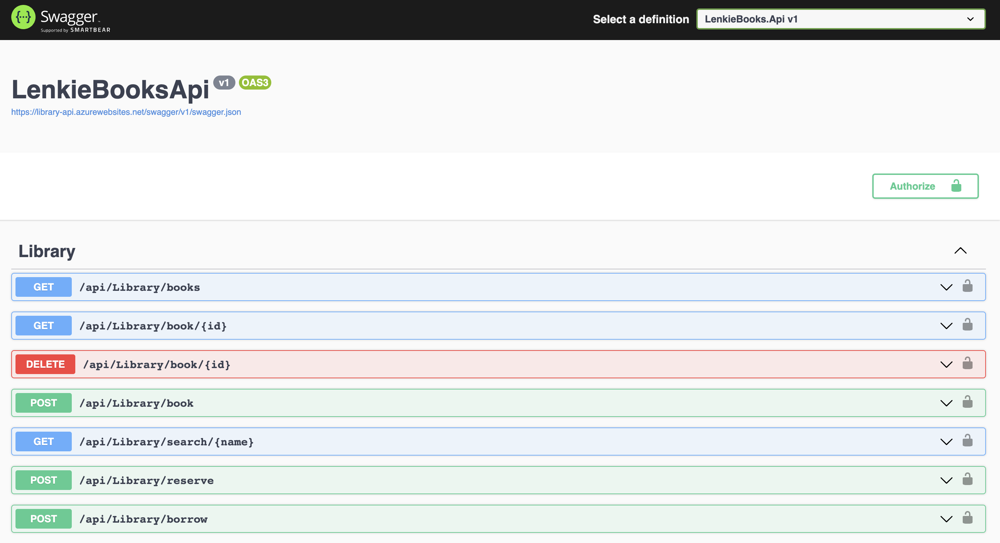
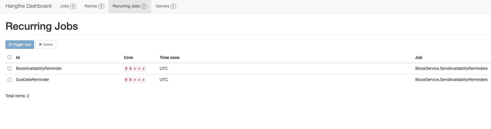

# Lenkie Books
# Introduction

Lenkie books API is an openAPI compliant web service that enables users to view, reserve and borrow books.
Key functionality includes background jobs (hangfire) that remind users when a book is due for submission
and when a book they previosly enquired about is available for borrowing.

Live demo: https://library-api.azurewebsites.net/swagger/index.html



Hangfire:



# Technologies Used

* ASP.NET Core (.NET 6) Web API  
* SwaggerUI (OpenAPI)
* Hangfire (background job scheduling)
* Microsoft Azure
   
# How do I get started?

You can run the solution by following the steps below:

1. Install .NET 6 SDK
2. Clone the Solution into your Local Directory
3. Navigate to the API project (LenkieBooks.Api) and run the below command to get the API running:

```sh
 dotnet run --project LenkieBooks.Api 
```

4. Open a browser, navigate to http://localhost:7084/swagger/index.html then view the Open API documentation.

# Testing endpoints on live environment

You don't have to run the project locally. You may access the live demo link provided in the section below 
to test the endpoints. All Library endpoints require authentication and authorization. Therefore, to test, these 
are the steps:

1. Create/Register new account
2. Login
3. Copy token from login response
4. Click the authorize button on the top right
5. Paste token in text field in this format "Bearer {token}"
6. After inserting the token all endpoints will now be available
   
## Deployments

The lenkie-books api is currently running on Microsoft Azure App Service. 

Here's the URL of the deployed web api:
[https://library-api.azurewebsites.net/swagger/index.html](https://library-api.azurewebsites.net/swagger/index.html)
